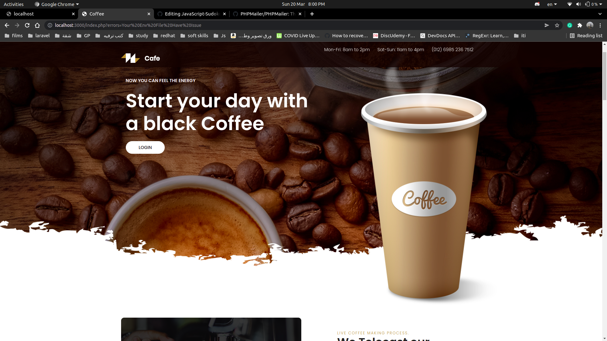
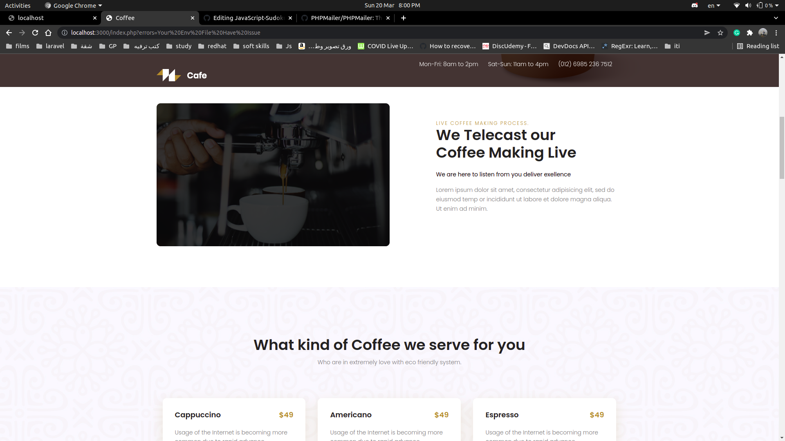
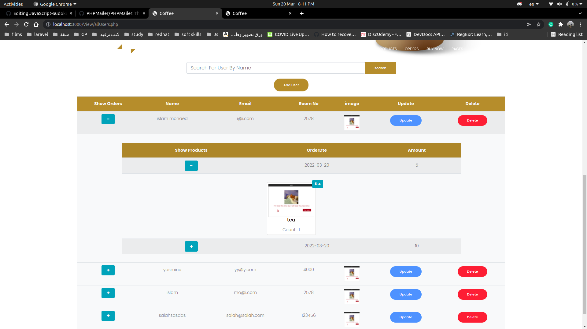
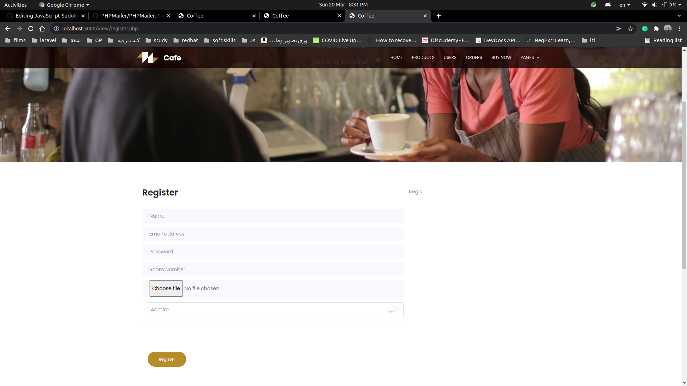
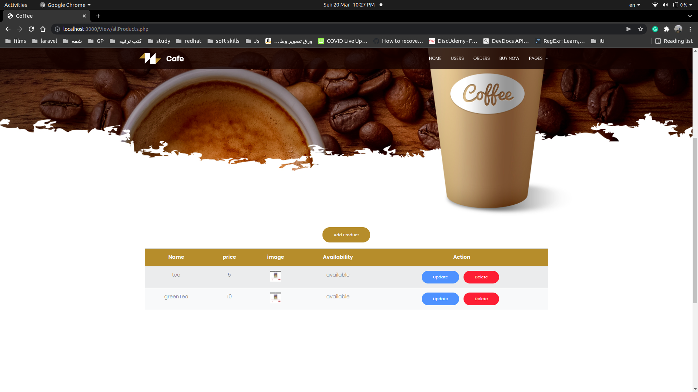
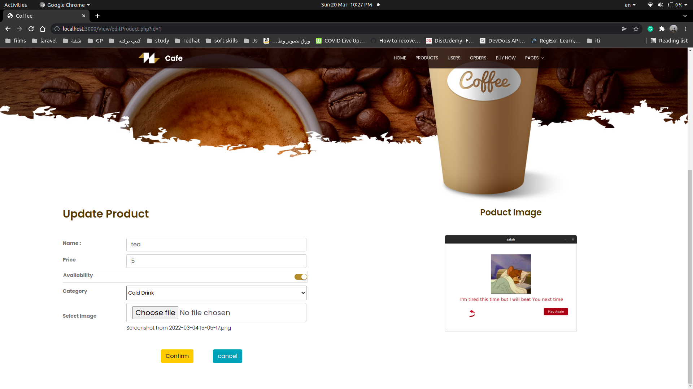
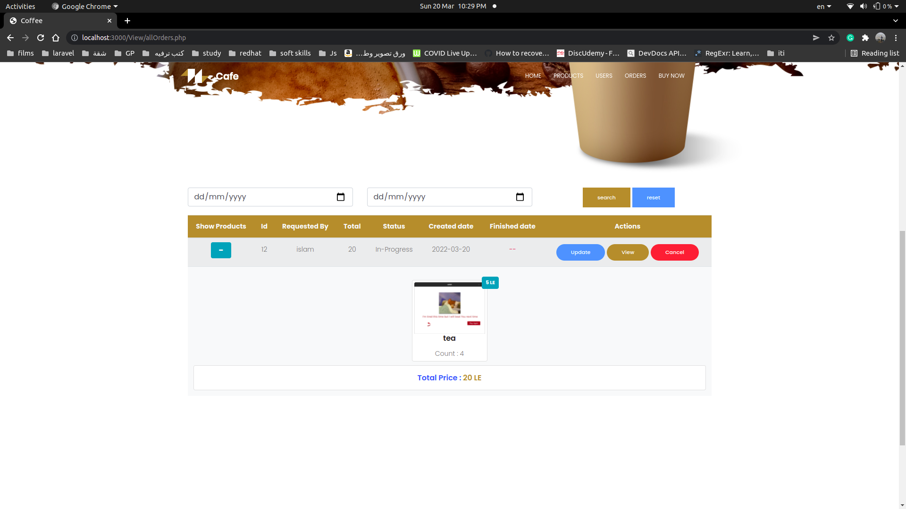
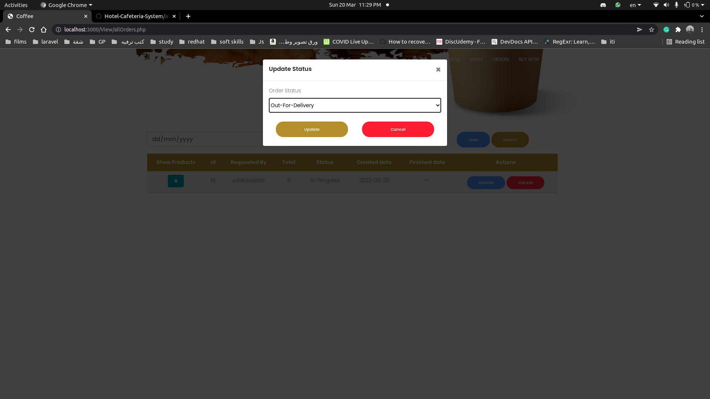

# Hotel-Cafeteria-System

The system is a cafeteria system suited for a hotel

## How to install?
You can start by downloading the project then follow this instructions

1. Import database file (coffee_shop.sql)
2. Rename .env.example to .env and change your data depend on your settings
    
    1. connection => Database enviroment ex(mysql) 
    2. dbname => Database name ex(coffe_shop)
    3. host => your host ex(127.0.0.1)
    4. port => your Database port ex(3306)
    5. user => your Database userName ex(root)
    5. password => your Database userName ex(12345)

**Renameing in linix `mv .env.example .env`**

open the "index.php" file **using a server**.
and login using userName=> **admin@admin.com**
password=>**123456**

# Definition of System:

This system designed for Hotel-Cafeteria to make orders online.

# Specifications:

There is admin by default will add some users then every user can use our system by login first using userName and email that admin give it to him.

This Cafeteria-System have many pages (HomePage-UsersPages-ProductsPages-OrdersPages)  

1. HomePage have some information about Cafeteria and login button.

2. UsersPages.

    1. (all User) this page display all users for admin and choose option update or delete.
    2. (register) this page to make admin able to add new user.  
    3. (update) this page to make admin able to update user.

3.  ProductsPages.

    1. (all products) this page display all products for admin.
    2. (add products) this page to make admin,user able to add new product and new category.  
    3. (editProduct) this page to make admin able to edit product info.

3.  OrdersPages.

    1. (all orders) this page display all orders for admin.
    2. (create Order) this page to make admin,user able to create order.  
    3. (myOrder) this page to make user able to display his orders.

# Snapshots:

### Home page:

 

### User Pages:

 

### Product Pages:

 

### Order Pages:

 

# Contributing and changing:

Pull requests are welcome. For major changes, please open an issue first to discuss what you would like to change.

Please make sure to update tests as appropriate.